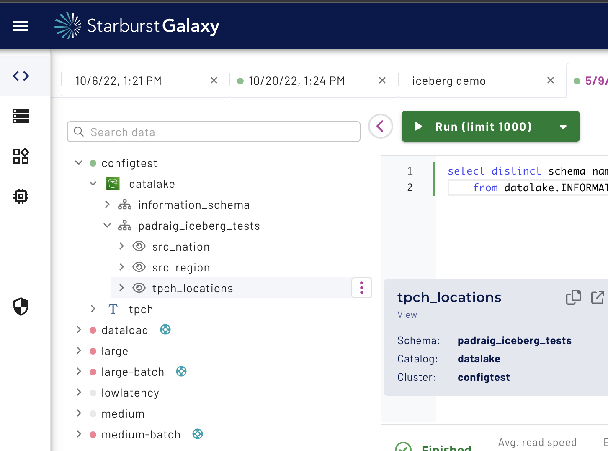

# Materialize models as views on galaxy

First, we will create a new role named `dbt` and see what fails
before we grant any privileges to it.

Our first `dbt run` will fail with:

```
Database Error
  TrinoUserError(type=USER_ERROR, name=PERMISSION_DENIED, message="Access Denied: Cannot create schema datalake.padraig_iceberg_tests: Role dbt does not have the privilege CREATE_SCHEMA on the catalog datalake", query_id=20230509_140629_82416_6xy4u)
```

Why is `dbt` trying to create a schema? First `dbt` will try
to see if the target schema already exists by running the
following query:

```
SELECT DISTINCT schema_name
FROM <catalog_name>.INFORMATION_SCHEMA.schemata
```

Since our `dbt` role has no permissions, the above query returns
0 rows. Thus, we will we grant all privileges on our target
schema to our `dbt` role:

```
grant all privileges on schema datalake.padraig_iceberg_tests to role dbt;
```

The query issued by `dbt` to get the list of schemas will now 
return the 1 schema our role has access to.

Trying to execute `dbt run` again will now fail with:

```
TrinoUserError(type=USER_ERROR, name=COLUMN_NOT_FOUND, message="line 7:12: SELECT * not allowed from relation that has no columns", query_id=20230509_141507_00398_6xy4u)
```

The `dbt` role needs to be granted privileges to read from our
source tables. The `dbt` role will also need the `WITH GRANT OPTION`
for materializing models as views as the default security mode
for views in Galaxy is `DEFINER`.

Thus, the privileges we need for our `dbt` role are:

```
GRANT SELECT ON "tpch"."tiny"."nation" TO ROLE dbt WITH GRANT OPTION;
GRANT SELECT ON "tpch"."tiny"."region" TO ROLE dbt WITH GRANT OPTION;
```

`dbt run` will now succeed and our models will be materialized
as views.

```
CREATE VIEW datalake.padraig_iceberg_tests.tpch_locations SECURITY DEFINER AS
WITH
  nation AS (
   SELECT *
   FROM
     datalake.padraig_iceberg_tests.src_nation
) 
, region AS (
   SELECT *
   FROM
     datalake.padraig_iceberg_tests.src_region
) 
, final AS (
   SELECT
     nation.nation_key
   , nation.name nation
   , nation.region_key
   , region.name region
   FROM
     (nation
   INNER JOIN region ON (nation.region_key = region.region_key))
) 
SELECT *
FROM
  final
ORDER BY nation_key ASC
```


